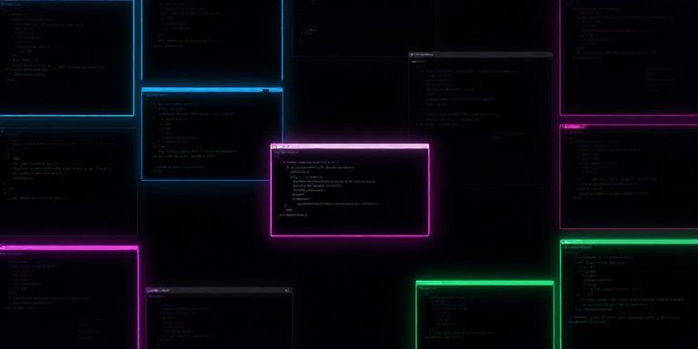

Done. The README covers the project purpose, features, prerequisites, installation, usage with examples, Discord commands, and build/test instructions — without implementation details or banner image references.