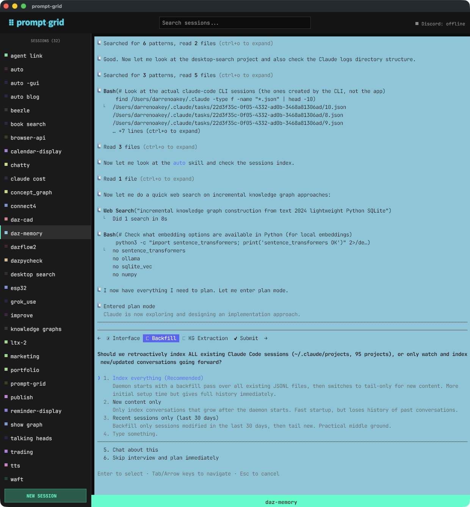

# prompt-grid

Meet **prompt-grid** — a beautiful, persistent terminal emulator for macOS that keeps your work alive across restarts, reboots, and everything in between.

If you've ever lost a terminal session to a crash, closed a window by accident, or wished you could check on a running process from your phone — prompt-grid has you covered.

---

## What Is It?

prompt-grid is a multi-session terminal emulator with a twist: **your sessions never die**. Restart your Mac, close the app, even lose power — when you come back, all your terminals are right where you left them, scrollback history and all.

It's especially great if you work with AI tools like Claude or Codex, since those sessions pick up right where they left off too.

---

## Getting Started

### Prerequisites

- macOS
- Go 1.21 or later
- [tmux](https://github.com/tmux/tmux/wiki) — if you don't have it, prompt-grid will install it for you automatically

### Build & Install

```bash
git clone https://github.com/darrenoakey/prompt-grid
cd prompt-grid
./run build
cp output/prompt-grid ~/bin/prompt-grid
```

### Launch It

```bash
# Open a session by name (creates it if it doesn't exist)
prompt-grid "My Project"

# Run as a background daemon so all future calls go through it
prompt-grid --daemon
```

That's it! A window appears with a sidebar of your sessions on the left and your terminal on the right.

---

## Features

### Persistent Sessions That Survive Everything

Sessions are backed by tmux, which means they keep running even after you close the app or restart your Mac. When you come back:

- All your sessions are restored exactly as you left them
- Scrollback history is replayed so you can see what happened while you were away
- Your current working directory in each session is remembered
- **Claude and Codex sessions** automatically resume with `--continue` / `--resume`

### Multiple Sessions, One Window

The left sidebar shows all your open sessions as colored tabs. Click any tab to switch. Each session gets its own color so you can tell them apart at a glance.

**Right-click on empty sidebar space** to:
- Create a new session
- Start a new Claude session in any of your project directories

**Right-click on a session tab** to:
- Rename it
- Change its color
- Pop it out into its own floating window
- Close it

### Pop-Out Windows

Need to keep an eye on two sessions at once? Pop any session out into its own window with a right-click. You can bring it back to the main panel anytime.

### Text Selection & Clipboard

- **Click and drag** to select text — it's automatically copied when you release
- **Cmd+C** copies your selection
- **Cmd+V** pastes from clipboard
- **Scroll wheel** to browse through terminal history

### Claude & Codex Sessions

prompt-grid has first-class support for AI coding assistants:

- Right-click the sidebar → **New Claude ▸** to see a menu of your project directories
- Pick a directory and a new session opens running `claude` in that folder
- When your Mac restarts, Claude sessions come back with `--continue` so the conversation continues

### Discord Remote Control (Optional)

Control your terminals from anywhere through Discord:

1. Create a Discord bot at the [Discord Developer Portal](https://discord.com/developers/applications)
2. Store the bot token in your macOS keychain:
   ```bash
   security add-generic-password -s prompt-grid -a discord_bot_token -w "YOUR_TOKEN"
   ```
3. Set your server ID and authorized user IDs in `~/.config/prompt-grid/config.json`

Once connected, each of your sessions gets its own Discord channel. You can:

| Command | What It Does |
|---|---|
| `/term list` | See all your active sessions |
| `/term new <name>` | Create a new session |
| `/term screenshot <name>` | Get a screenshot of a session |
| `/term run <name> <cmd>` | Run a command in a session |
| `/term connect <name>` | Start streaming a session's output to Discord |
| `/term disconnect <name>` | Stop streaming |
| `/term focus <name>` | Bring a window to front on your Mac |
| `/term close <name>` | Close a session |

This is incredibly handy for checking on long-running tasks, monitoring builds, or even doing quick edits when you're away from your desk.

---

## Tips & Tricks

**Name your sessions meaningfully.** Since they persist forever, names like "api-server", "frontend-dev", and "claude-backend" let you jump right back in without hunting around.

**Use the color system.** Each session gets a unique color that carries through to its tab and window title. Right-click → "New Color" if you want a different one.

**Set up SSH sessions.** You can create sessions that connect to remote servers. They reconnect automatically on restart.

**Keep it running as a daemon.** Run `prompt-grid --daemon` once (or set it up to launch at login) and all future `prompt-grid "Session Name"` calls will open in your existing instance — no duplicate windows.

**Scroll back without losing your place.** Scroll up to read history; any new output snaps you back to the live view automatically.

**Use Discord streaming for long jobs.** Start a build or test run, `/term connect` it to Discord, and get a live feed on your phone while you step away.

---

## Configuration

Everything is stored in `~/.config/prompt-grid/`:

- `config.json` — sessions, colors, Discord settings, window sizes
- `sessions/` — scrollback logs for each session

You don't need to edit these manually — prompt-grid manages them for you.

---

## License

MIT — do whatever you like with it.